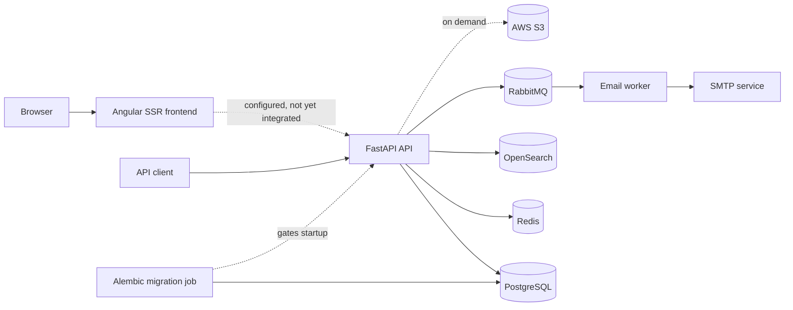

# Architecture

This document describes the architecture implemented on `main`. The final section is directional
and does not promise product features or delivery dates.

## System context



Docker Compose runs the frontend, API, email worker, and local infrastructure. AWS S3 and SMTP are
external integrations. A one-shot Alembic service applies pending migrations after PostgreSQL is
healthy and must finish successfully before the API starts. S3 is intentionally not emulated
locally.

## Frontend

`frontend/` is an Angular 20 application configured for server-side rendering. Express hosts the
compiled server bundle in production. Compose supplies `API_BASE_URL=http://api:8000` for future
server-side integration on the internal network; no frontend code consumes it yet.

The frontend currently contains the generated starter screen and no application routes. The API is
therefore usable independently while the product UI is developed.

## Backend

`backend/src/main.py` creates the FastAPI application, owns the application lifespan, registers
dependencies, and composes middleware and routers. Backend code is divided by responsibility:

- `application/` owns configuration, contracts, and the IoC implementation.
- `features/` owns vertical product capabilities. Authentication is the first feature.
- `infrastructure/` owns database, cache, search, messaging, email, and object-storage adapters.
- `shared/` owns cross-cutting middleware, request helpers, safe exceptions, and utilities.
- `workers/` contains independently running message consumers.

Feature code does not belong in `shared`, and infrastructure-specific behavior does not belong in
`application`.

### Dependency lifetimes

The container is built in `build_container` in `backend/src/main.py`:

- **Singleton:** immutable settings and long-lived infrastructure clients owned by the app
  lifespan.
- **Scoped:** request-owned resources such as `AsyncSession`, repositories, and feature services.
- **Transient:** stateless, short-lived helpers such as token, rate-limit, email-publisher, and
  email-filter services.

HTTP request middleware creates and disposes one dependency scope per request. Routes resolve
dependencies from that scope rather than constructing infrastructure clients directly.

## Runtime flows

### HTTP requests

The middleware stack applies CORS, a request dependency scope, request ID and timing logs, security
headers, and exception translation. Expected failures use exceptions from
`backend/src/shared/exceptions` and become:

```json
{
  "error": {
    "code": "machine_readable_code",
    "message": "Safe client-facing message."
  }
}
```

Unexpected exceptions are logged internally and returned as a generic error. Raw exception
messages, stack traces, and credentials are never part of an HTTP response.

The API exposes liveness at `/health/live` and dependency readiness at `/health/ready`. Readiness
checks PostgreSQL, Redis, OpenSearch, and RabbitMQ. S3 is created on demand and is not part of the
readiness check.

### Authentication

The authentication feature supports signup, email verification, login, refresh-token rotation,
logout, password recovery and changes, current-user lookup, and Google, Microsoft, and Apple token
verification. PostgreSQL stores users and OAuth identities. Redis stores refresh sessions,
single-use codes, throttles, and the optional email-availability Cuckoo filter.

Access tokens are short-lived JWTs. Refresh tokens are opaque, stored in Redis by keyed digest, and
returned in an HTTP-only cookie. Reuse detection revokes the affected token family.

### Email delivery

Authentication services publish verification and password-reset jobs to RabbitMQ. The independent
email worker validates jobs and sends them over SMTP. Temporary failures move through delayed retry
queues before dead-lettering; invalid, expired, or permanently rejected messages are not retried.

## Data and infrastructure

- **PostgreSQL:** authoritative relational data, accessed asynchronously through SQLAlchemy.
  Alembic owns schema changes; the Compose migration job applies them before API startup, while
  other environments must run the same migration command as a deployment step. Application startup
  must not create tables.
- **Redis:** sessions, verification codes, throttles, and probabilistic email-availability state.
- **OpenSearch:** connected as a long-lived client and included in readiness; no product search
  feature is exposed yet.
- **RabbitMQ:** durable asynchronous email jobs and retry/dead-letter routing.
- **AWS S3:** external object storage available to future features through an on-demand client.

## Configuration

Backend settings are layered with the following precedence, highest first:

1. Constructor arguments
2. Process environment
3. Root `.env`
4. `backend/config/<APP_ENV>.yml`
5. `backend/config/default.yml`
6. Field defaults

`APP_ENV` is `dev`, `test`, or `prod` and defaults to `dev`. Test configuration deliberately skips
the root `.env` so local secrets cannot affect the suite. Unknown YAML keys fail startup. YAML
values may interpolate `${VAR}` or `${VAR:-fallback}` from the environment and, outside tests, the
root `.env`.

Non-secret tunables belong in YAML. Secrets, credential-bearing connection URLs, and values read
directly by Compose belong in the ignored root `.env` and must be represented safely in
`.env.example`.

## Engineering roadmap

These are architectural directions rather than release commitments:

1. Replace the starter frontend with authenticated application routes and a typed boundary to the
   existing API.
2. Establish the first game-domain feature as its own vertical backend module and matching frontend
   area, preserving independent builds and avoiding premature shared abstractions.
3. Add production observability for request traces, structured metrics, worker health, queue depth,
   and dependency performance without exposing sensitive values.
4. Define repeatable deployment, migration, rollback, and secret-management procedures for a
   production environment.
5. Automate repository-wide Semantic Versioning, changelog finalization, artifact production, and
   GitHub Releases after the first release process is agreed.

Material design changes should be recorded here in the same pull request that implements them.
